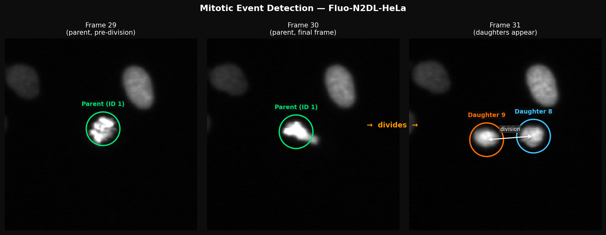

# Mitotic Event Classifier

A MATLAB pipeline for detecting and classifying cell division (mitosis) events in fluorescent HeLa cell microscopy videos from the [Cell Tracking Challenge](http://celltrackingchallenge.net/2d-datasets/) (Fluo-N2DL-HeLa dataset).



*A detected mitotic event — **Parent cell 1** (green) is tracked in frames 29 and 30. In frame 31 it has divided into **Daughter 8** (blue) and **Daughter 9** (orange), both spatially proximate to the parent's last known position. Dataset: Fluo-N2DL-HeLa.*

---

## Overview

Cell division produces two spatially proximate daughter cells in the frame immediately following a parent cell's disappearance. This project detects those events by:

1. **Spatial proximity detection** — finding the two nearest daughter candidates within an adaptive, area-scaled distance threshold
2. **Temporal validation** — confirming daughters appear exactly one frame after the parent ends
3. **Statistical analysis** — fitting univariate and bivariate Gaussian models to the parent-daughter distances and using Bayesian posteriors to evaluate classification quality

---

## Project Structure

```
.
├── core/
│   ├── classify_mitotic_event.m    # Core function: detect daughters for one parent cell
│   ├── detect_mitotic_events.m     # Main script: run detection across all cells
│   └── validate_detections.m       # Compare detections against ground truth
│
├── analysis/
│   ├── univariate_analysis.m       # Bayesian classification, t-tests, PDF plots
│   └── multivariate_analysis.m     # Bivariate Gaussian fit, contour visualisation
│
├── visualization/
│   ├── demo_single_frame.m         # Quick single-frame annotated display
│   ├── display_frames.m            # Side-by-side multi-frame montage
│   ├── create_tracking_video.m     # Render all frames to an AVI video
│   └── export_frame_pngs.m         # Batch export all frames as PNGs
│
├── tests/
│   └── test_detection.m            # Sanity test on known parent-daughter pair
│
├── data/
│   └── README.md                   # Dataset structure and download instructions
│
└── README.md
```

---

## Algorithm

### Detection (`core/`)

```
For each parent cell:
  1. Load segmentation mask for parent's last frame
  2. Compute adaptive threshold:  threshold = sqrt(parent_area) × 2.0
  3. Load segmentation for the next frame (candidate daughter frame)
  4. Filter candidate cells by minimum area (≥ 10 px)
  5. Compute Euclidean distances from parent centroid to all candidates
  6. Accept if two closest candidates are both within threshold
  7. Reject if inter-daughter distance > 15 px (false positive guard)
```

### Statistical Analysis (`analysis/`)

After running detection, distances between parent and each daughter cell (`Distance1`, `Distance2`) are analysed:

- **Univariate**: Separate Gaussians fit to correct vs. incorrect classifications; Bayesian posteriors computed; Welch t-tests assess feature discriminability.
- **Multivariate**: Bivariate Gaussian fit to (Distance1, Distance2) jointly; log-likelihood and contour plot reported.

---

## Quick Start

### 1. Download the dataset

Follow the instructions in [`data/README.md`](data/README.md) and place the dataset under `data/Fluo-N2DL-HeLa-Train/`.

### 2. Run detection

Open MATLAB, `cd` to the project root, then:

```matlab
% Add core functions to path
addpath('core')

% Run the main detection pipeline
run('core/detect_mitotic_events.m')
```

Expected console output:
```
Mitotic event: Parent 1  ->  Daughters 8 & 9  (Frame 30)
...
Total mitotic events detected: N
```

### 3. Validate against ground truth

```matlab
run('core/validate_detections.m')
```

### 4. Statistical analysis

```matlab
% Requires results_table and data (man_track.txt) in workspace
run('analysis/univariate_analysis.m')
run('analysis/multivariate_analysis.m')
```

### 5. Visualise

```matlab
% Single frame
run('visualization/demo_single_frame.m')

% Side-by-side frames (edit the frames array inside the script)
run('visualization/display_frames.m')

% Full tracking video
run('visualization/create_tracking_video.m')

% Export all frames as PNGs
run('visualization/export_frame_pngs.m')
```

### 6. Run the sanity test

```matlab
run('tests/test_detection.m')
```

---

## Dataset

**Fluo-N2DL-HeLa** — HeLa cell nuclei imaged via fluorescence microscopy.

| Property         | Value                            |
|------------------|----------------------------------|
| Resolution       | 512 × 512 pixels                 |
| Frames per video | 92 (t000 – t091)                 |
| Training videos  | 2 sequences (01, 02)             |
| Test videos      | 2 sequences (01, 02)             |
| Total cells      | ~389 per video (training)        |
| Annotation       | Manual (man_track.txt + TIF masks) |

The `man_track.txt` file maps every cell to its parent: a non-zero parent ID indicates a mitotic event.

---

## Requirements

- MATLAB R2020b or later
- Image Processing Toolbox (`regionprops`, `visboundaries`)
- Statistics and Machine Learning Toolbox (`normpdf`, `mvnpdf`, `ttest2`)

---

## Course Context

ECE 687 — Pattern Recognition project.  
Dataset: [Cell Tracking Challenge — Fluo-N2DL-HeLa](http://celltrackingchallenge.net/2d-datasets/)
